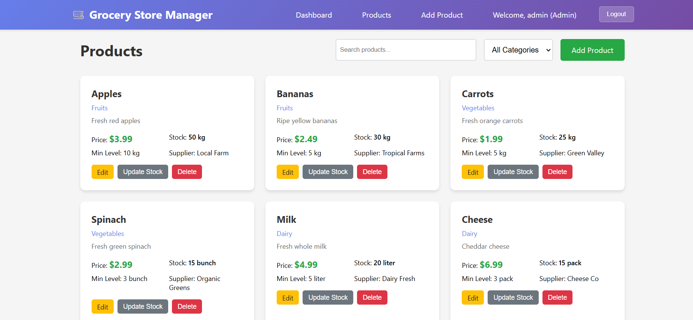

A comprehensive full-stack web application for managing grocery store inventory with real-time stock tracking, user authentication, and role-based access control.

## Login Page and Registration Option

## Admin Dashboard

## Product Page(Admin can view the items and add,update and delete them as well)

## Page to add new items 

## User Dashboard and successful login message

## Product Page(User can only view the items)

